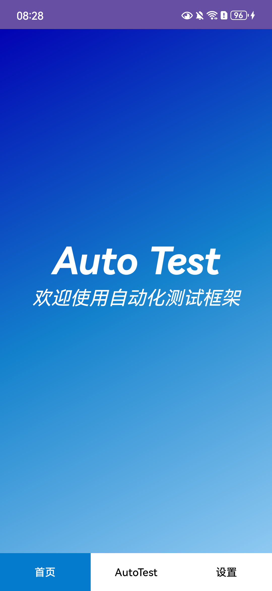
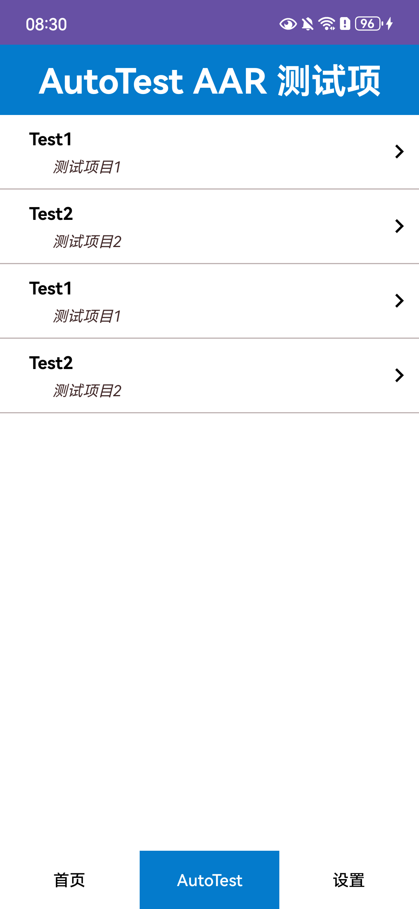
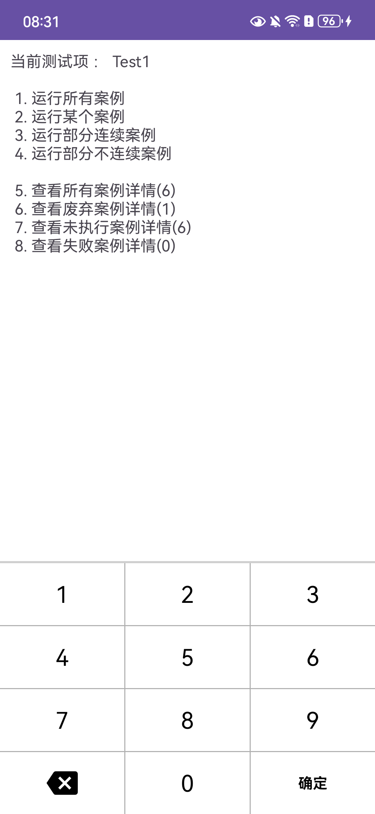
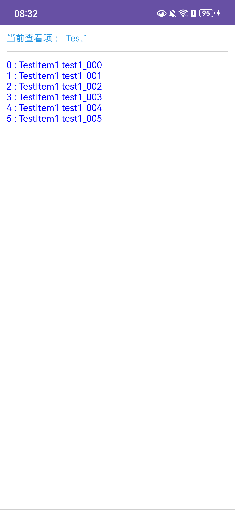
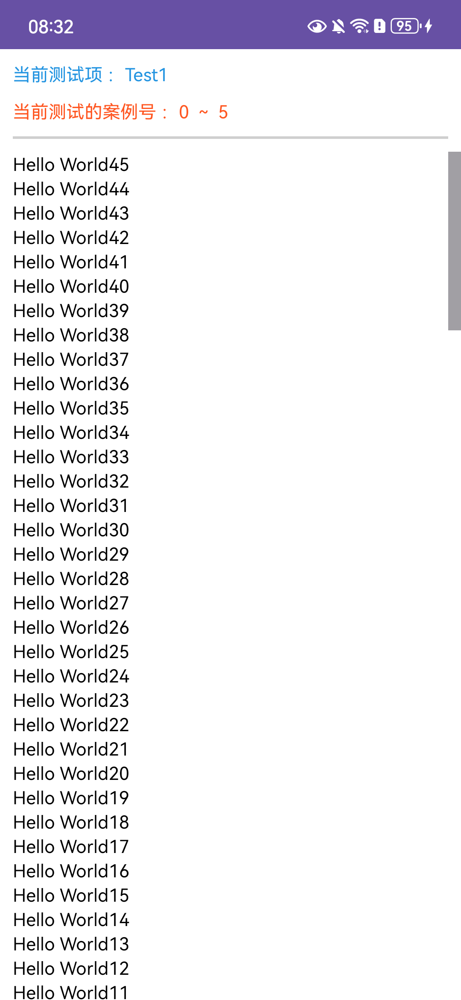
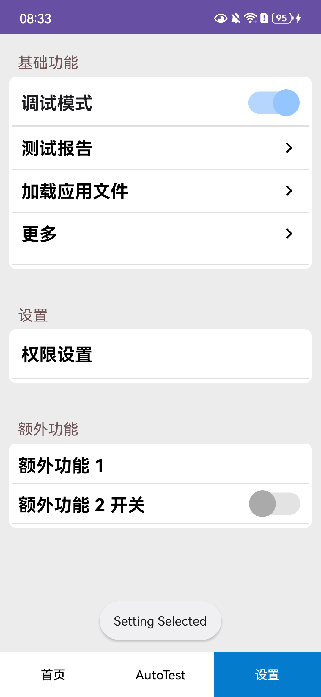
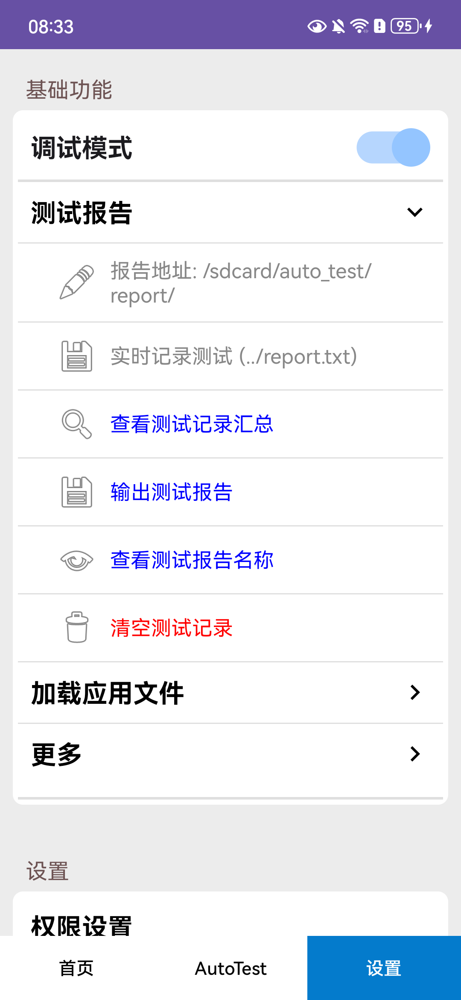

# Android-AutoTest —— 安卓自动化测试框架

一套**注解驱动**的安卓端自动化测试框架：宿主 App 只需继承几个基类、给测试方法加注解，即可获得完整的「测试项管理 → 设备上执行 → 实时日志 → 结果记录 → 历史持久化 → Excel/txt 报告输出」能力。

本 README **只针对 AAR 模式**（即仓库内 `app-aar` 示例工程所使用的集成方式）编写：框架以单个 AAR 文件交付，宿主工程以 `libs/` + `fileTree` 方式接入。

当前版本：**2.0.04**（版本号以根 `build.gradle` 的 `ext.autotestVersionName` 为唯一来源）。

---

## 目录

- [1. 框架能力总览](#1-框架能力总览)
- [2. 集成（AAR 模式）](#2-集成aar-模式)
- [3. 应用使用指南（界面与按钮逐项说明）](#3-应用使用指南界面与按钮逐项说明)
- [4. API 参考（如何调用 auto-test 的接口）](#4-api-参考如何调用-auto-test-的接口)
- [5. 测试结果与报告](#5-测试结果与报告)
- [6. 设备兼容与废弃案例](#6-设备兼容与废弃案例)
- [7. 维护者指南：版本与发布](#7-维护者指南版本与发布)
- [8. 常见问题（FAQ）](#8-常见问题faq)

---

## 1. 框架能力总览

| 能力 | 说明 |
|------|------|
| 注解声明测试项/案例 | `@TestItem` 声明测试项，`@TestCase` 声明案例方法，无需手工注册 |
| 导航页签自动装配 | 主界面底部/顶部 Tab 由 `@Navigation` 注解的 Fragment 自动生成 |
| 设备上执行与交互 | 内置选项菜单、数字键盘，支持全量/单个/连续区间/不连续子集执行 |
| 实时日志界面 | 执行过程按颜色区分：框架信息（蓝）、普通日志（黑）、通过（绿）、失败（红）、废弃/设备不支持（紫红）、完成（黄） |
| 结果记录与历史持久化 | Room 数据库保存每次结果，重启 App 自动恢复历史 |
| 报告输出 | txt 实时报告（调试模式）+ Excel（.xls/.xlsx，汇总 + 详情双 Sheet，支持中英表头） |
| 设备兼容控制 | 测试项/案例级 `unsupportedDevice` 黑名单，命中自动跳过并提示 |
| 废弃案例管理 | `abandon = true` 标记废弃，单独统计、单独查看 |
| 启动页预热 | `AutoTestSplashActivity` 品牌启动页 + 后台预热 + 最小展示时长 |
| 人机交互式案例 | 阻塞式对话框工具 `DialogUtils`，可在案例线程中等待用户输入 |
| 物理键盘支持 | 宿主重写 `isPhysicalKeyboard()` 后隐藏屏幕键盘，改用实体键操作 |
| 宿主扩展点 | 设置页 `@Function` 注解动态生成按钮/开关；报告路径、assets 目录、报告名前缀等均可重写 |

### 仓库结构

| 目录 | 说明 |
|------|------|
| `auto-test/` | 框架源码（Android Library），AAR 的生产方 |
| `app-aar/` | **AAR 模式示例工程**（本文档的全部截图与代码示例来源），通过 `libs/hudou-autotest-2.0.04.aar` 接入 |
| `local-maven-repo/` | `publishAutoTest` 的发布目录，含 AAR、POM、Gradle Module 元数据与校验和 |
| `app/` | 源码模式示例工程（`implementation project(':auto-test')`），**不在本文档范围内** |

---

## 2. 集成（AAR 模式）

### 2.1 获取 AAR

两种方式任选：

1. **直接从本仓库拷贝**（推荐）：`app-aar/libs/hudou-autotest-2.0.04.aar`；
2. **自行构建**：在仓库根目录执行

   ```bash
   ./gradlew publishAutoTest
   ```

   产物位于 `local-maven-repo/com/github/LYH20001111/Android-AutoTest/<版本>/Android-AutoTest-<版本>.aar`，拷出后文件名可任意改（如 `hudou-autotest-2.0.04.aar`），不影响使用。

### 2.2 放置 AAR 并声明依赖

将 AAR 放入你 App 模块的 `libs/` 目录，然后在模块 `build.gradle` 中：

```groovy
android {
    // 框架内部使用 ViewBinding，宿主必须开启
    buildFeatures {
        viewBinding = true
    }
}

dependencies {
    // 引入 libs 目录下所有 jar/aar（含 auto-test AAR）
    implementation fileTree(include: ['*.jar', '*.aar'], dir: 'libs')
}
```

> 要求：`minSdk >= 24`，`compileSdk >= 34`，Java 8 编译选项。

### 2.3 手动补齐框架的传递依赖（重要）

**原始 AAR 文件不携带 POM 元数据**，Gradle 不会自动解析框架内部用到的第三方库，必须由宿主手动声明。以下为框架运行**必需**的依赖（与 `app-aar/build.gradle` 一致，已真机验证）：

```groovy
dependencies {
    implementation fileTree(include: ['*.jar', '*.aar'], dir: 'libs')

    // ===== auto-test 框架运行必需 =====
    implementation 'androidx.appcompat:appcompat:1.6.0'
    implementation 'com.google.android.material:material:1.9.0'
    implementation 'androidx.constraintlayout:constraintlayout:2.1.4'
    implementation 'androidx.core:core-splashscreen:1.0.1'      // 启动页
    implementation 'net.sourceforge.jexcelapi:jxl:2.6.12'      // Excel 报告
    implementation 'androidx.room:room-runtime:2.5.2'          // 结果历史持久化
    implementation 'androidx.swiperefreshlayout:swiperefreshlayout:1.0.0'

    // ===== 以下属于 app-aar 自己的演示功能，框架不需要 =====
    // implementation 'com.google.zxing:core:3.4.0'            // 扫码（App 业务）
    // implementation 'org.apache.poi:poi:3.16'                // App 业务 Excel 处理
    // implementation 'com.airbnb.android:lottie:5.2.0'        // App UI 动画
}
```

说明：

- `recyclerview` 会随 `material` 传递引入，无需单独声明；
- 框架的 Room 数据库实现类已编译进 AAR，宿主**不需要** `room-compiler` 注解处理器（app-aar 中保留它只是历史原因）；
- 缺依赖的典型表现是运行期 `NoClassDefFoundError`，见 [FAQ](#8-常见问题faq)。

### 2.4 AndroidManifest 配置

```xml
<uses-permission android:name="android.permission.READ_EXTERNAL_STORAGE"/>
<uses-permission android:name="android.permission.WRITE_EXTERNAL_STORAGE"/>

<application android:theme="@style/Theme.AutoTest"> <!-- 或你自己的 Material3 主题 -->

    <!-- 启动页：必须使用框架提供的 Splash 主题，否则冷启动先闪白屏 -->
    <activity
        android:name=".SplashActivity"
        android:exported="true"
        android:theme="@style/Theme.AutoTest.SplashScreen">
        <intent-filter>
            <action android:name="android.intent.action.MAIN" />
            <category android:name="android.intent.category.LAUNCHER" />
        </intent-filter>
    </activity>

    <activity android:name=".MainActivity" android:exported="false" />
</application>
```

### 2.5 集成代码四件套

**① 启动页** —— 继承 `AutoTestSplashActivity`，指向主界面：

```java
public class SplashActivity extends AutoTestSplashActivity {
    @Override
    public Class<?> getTargetActivity() {
        return MainActivity.class;
    }
    // 可选重写：getSplashTitle() / getSplashIconResId() /
    //          getSplashLoadingLayoutResId() / getMinDisplayDuration() / onPreloadData()
}
```

**② 主界面** —— 继承 `AutoTestMainActivity`，**不要**调用 `setContentView`（基类自带布局），并注册导航 Fragment：

```java
public class MainActivity extends AutoTestMainActivity {
    @Override
    protected void onCreate(Bundle savedInstanceState) {
        super.onCreate(savedInstanceState);
        // setContentView(...)  ← 删除/不要写
    }

    @Override
    public void addNavigationFragment(List<Fragment> list) {
        // list 中已预置首页 HomeFragment；不需要首页可：
        // list.removeIf(fragment -> fragment instanceof HomeFragment);
        list.add(new PSFragment());      // 测试项列表页
        list.add(new SettingFragment()); // 设置页
    }

    // 物理键盘设备（扫码枪/PDA 等）返回 true，隐藏屏幕数字键盘
    @Override
    public boolean isPhysicalKeyboard() {
        return super.isPhysicalKeyboard();
    }
}
```

**③ 测试项列表页** —— 继承 `AutoTestTestListFragment`，用 `@Navigation` 定 Tab 名、`@TestItemClass` 绑定测试项类：

```java
@Navigation(name = "AutoTest")
@TestItemClass(clz = {TestItem1.class, TestItem2.class, TestItem3.class, TestItem4.class})
public class PSFragment extends AutoTestTestListFragment {
    @Override
    public String onNameTitle() {
        return "AutoTest AAR 测试项";   // 页面大标题，默认“测试项目”
    }
}
```

**④ 设置页（可选扩展）** —— 继承 `AutoTestSettingFragment`（自身已带 `@Navigation(name = "设置")`，且注解可继承）：

```java
public class SettingFragment extends AutoTestSettingFragment {
    @Override
    public void onFragmentVisibility() {          // 每次切到该 Tab 时回调
        super.onFragmentVisibility();
    }

    @Override
    public String onSetReportPath() {             // 自定义报告输出目录，返回 null 用默认
        return super.onSetReportPath();
    }

    @Override
    public String onSetTestFilesPath() {          // 自定义测试文件加载目录
        return super.onSetTestFilesPath();
    }

    @Override
    public List<String> addAssetsDirs() {         // assets 一级目录，供“加载测试应用文件”使用
        return new ArrayList<String>() {{ add("document"); add("test"); }};
    }

    @Override
    public String onAddReportNamePrefix() {       // Excel 报告文件名前缀
        return "AutoTest-";
    }

    // @Function 注解的方法会自动渲染成设置页“额外功能”区的按钮/开关，见 3.9
    @Function(title = "额外功能 1 ")
    private void function1() { }

    @Function(title = "额外功能 2 开关", type = FunctionType.SWITCH, isChecked = false)
    private boolean function2() { return false; }
}
```

**⑤ 测试项类** —— 继承 `AutoTestTestItem`，方法加 `@TestCase`：

```java
@TestItem(name = "Test1", description = "测试项目1", unsupportedDevice = {"DUK-AL20"})
public class TestItem1 extends AutoTestTestItem {

    @Override
    public void onCaseStart(Method method) {      // 每个案例执行前
        super.onCaseStart(method);
        recordMessage("=============" + method.getName() + "=============");
    }

    @Override
    public void onCaseFinish(Method method) {     // 每个案例执行后（等待结果前）
        super.onCaseFinish(method);
        recordPass();                             // 或 recordFail()
    }

    @TestCase(name = "TestItem1 test1_000")
    private void test1_000() {
        recordMessage("wo hen hao");
    }

    @TestCase(name = "TestItem1 test1_004", unsupportedDevice = {"P70", "N950"})
    private void test1_004() { recordMessage("Ni Hao Shi Jie"); }

    @TestCase(name = "TestItem1 test1_005", abandon = true, abandonDes = "外设已下架")
    private void test1_005() { recordMessage("Ni Hao Shi Jie"); }
}
```

要点：

- 案例方法**可以是 private**，框架反射调用；
- 案例执行顺序按**方法名字典序**排序，与书写顺序无关；
- 每个案例必须最终调用 `recordPass()` / `recordFail()` 之一，框架会阻塞等待结果落库（详见 [4.6](#46-autotesttestitem-与案例生命周期)）。

### 2.6 构建与验证

```bash
./gradlew :app-aar:installDebug     # 本仓库示例工程
# 或你自己的工程：
./gradlew :app:installDebug
```

启动后看到品牌启动页 → 自动进入三 Tab 主界面 → 进入测试项执行一轮案例 → 设置页输出 Excel 报告，即集成成功。

### 2.7 可选：Maven 坐标方式接入

同一个 AAR 也带完整 POM 元数据发布在 `local-maven-repo/`。若希望**免去 2.3 的手工依赖**，可改用坐标方式（Gradle 自动传递解析）：

```groovy
// settings.gradle
dependencyResolutionManagement {
    repositories {
        google()
        mavenCentral()
        maven { url = uri("<拷贝出的 local-maven-repo 目录路径>") }
    }
}

// 模块 build.gradle
dependencies {
    implementation 'com.github.LYH20001111:Android-AutoTest:2.0.04'
}
```

`app-aar` 当前采用的是 2.2/2.3 的原始 AAR 文件方式，两种方式的 AAR 本体完全相同（md5 一致）。

---

## 3. 应用使用指南（界面与按钮逐项说明）

以下截图均来自真机运行的 `app-aar`（1080×2376，华为 Android 12）。

### 3.1 启动页


- 显示品牌标题（`getSplashTitle()`，示例为 “Auto Test AAR”）、品牌图标与加载动画，底部文案“正在加载配置，请稍候…”；
- 后台线程执行 `onPreloadData()`（示例故意 sleep 7s 模拟预热），**预热完成且满足最小展示时长**（`getMinDisplayDuration()`，示例 10s，默认 1200ms）后自动跳转主界面；
- 预热抛异常不会卡死启动页，仍会跳转。

### 3.2 主界面结构



- 底部为导航 Tab，由 `addNavigationFragment()` 决定，示例为 **首页 / AutoTest / 设置** 三个页签；
- 点击 Tab 切换页面，每次切换会触发目标 Fragment 的 `onFragmentVisibility()`（示例设置页切中时弹 Toast “Setting Selected”）；
- 在非执行页面按返回键，弹出“您确定要退出应用吗？”确认框（确定退出 / 取消）。

### 3.3 首页

框架内置欢迎页，渐变背景 + “Auto Test / 欢迎使用自动化测试框架”。不需要时可在 `addNavigationFragment` 中 `removeIf(fragment -> fragment instanceof HomeFragment)` 移除。

### 3.4 测试项列表页



- 大标题来自 `onNameTitle()`（示例 “AutoTest AAR 测试项”）；
- 列表项来自 `@TestItemClass(clz = {...})` 绑定的测试项类，显示 `@TestItem` 的 `name` 与 `description`，重复的 class 自动去重；
- **点击某一行** → 进入该测试项的选项页（3.5）。

### 3.5 测试项选项页



顶部显示“当前测试项 ： Test1”与 8 个选项菜单，括号内数字为实时统计（总案例数 / 废弃数 / 未执行数 / 失败数，来自历史记录）。**通过底部数字键盘输入选项编号**（如按 `1`）即触发对应功能：

| 编号 | 选项 | 行为 |
|------|------|------|
| 1 | 运行所有案例 | 直接进入执行页，按案例号顺序执行全部案例 |
| 2 | 运行某个案例 | 进入案例页并打印案例号列表，输入案例号 + 确定 → 执行该案例 |
| 3 | 运行部分连续案例 | 打印列表，先点“点击输入起始案例号”、再点“点击输入结束案例号”，校验合法后自动开始执行 [起, 止] 区间 |
| 4 | 运行部分不连续案例 | 打印列表，输入案例号 + 确定 逐个加入“已选案例”列表（点击已选列表可删除/修改某项）；输入为空时按确定 → 执行已选子集 |
| 5 | 查看所有案例详情(N) | 蓝色打印 `0 : 案例名` 形式的全部案例清单（见 3.7） |
| 6 | 查看废弃案例详情(N) | 灰色打印 `abandon = true` 的案例清单 |
| 7 | 查看未执行案例详情(N) | 浅蓝打印尚无执行记录的案例清单 |
| 8 | 查看失败案例详情(N) | 红色打印最近一次结果为失败的案例清单 |

设备兼容保护：若当前设备命中该测试项的 `unsupportedDevice`，进入本页即弹窗提示“该测试项不适用当前设备型号”，且**运行类选项（1–4）被拦截**，查看类选项（5–8）不受影响。

#### 数字键盘

- 3×4 布局：`1–9`、`删除`、`0`、`确定`；
- 选项页输入选项编号后**立即生效**（无需确定）；案例号输入页需按“确定”提交；
- 宿主 `isPhysicalKeyboard()` 返回 `true` 时屏幕键盘隐藏，改用物理键：`0–9` 输入、`DEL` 删除、`ENTER` 确定；
- 框架另提供 `NumberKeyBoardView.shuffleKeyboard()`，宿主可调用它随机打乱数字键位（防肌肉记忆误触场景），默认不打乱。

### 3.6 案例号输入页（选项 2/3/4 共用）

- 顶部“当前测试项 ： X”，中部“请输入测试案例号 ：”与输入回显；
- 选项 3 额外显示“点击输入起始案例号 / 点击输入结束案例号”两个按钮，弹出输入框录入；起始号必须先于结束号、结束号必须大于起始号且小于案例总数，否则 Toast 提示；
- 选项 4 额外显示“已选案例(n) ：…”行，点击弹出列表对话框，可对每个已选案例号执行 **删除 / 修改**。

### 3.7 案例详情查看页



- 顶部“当前查看项 ： Test1”，正文按颜色输出对应清单（全部=蓝、废弃=灰、未执行=浅蓝、失败=红）；
- 清单格式为 `案例号 : @TestCase(name)`，案例号即选项 2/4 中输入的编号。

### 3.8 执行页



- 顶部两行：当前测试项、当前测试的案例号范围（如 `0 ~ 5`，单个案例则只显示一个编号，不连续子集显示 `0, 3, 5` 形式）；
- 正文为**实时滚动日志**，颜色含义：

  | 颜色 | 含义 |
  |------|------|
  | 蓝 | 框架信息：开始执行案例 X、案例执行结束、案例清单 |
  | 灰 | 案例提示（`@TestCase(tip)`） |
  | 黑 | 宿主 `recordMessage(...)` 输出（调试模式开启时上屏） |
  | 绿 | `recordPass()` 测试通过 |
  | 红 | `recordFail()` 测试失败 / 未捕获异常（附异常类名与消息） |
  | 紫红 | 废弃案例、设备不支持跳过 |
  | 黄 | “案例执行完毕，可点击返回按钮继续” |

- **执行期间返回键被禁用**，防止误退；**长按返回键**弹出“您确定要中断测试吗”对话框，确认后**当前案例执行完即中断**，后续案例跳过；
- 全部案例执行完后返回键恢复，退回上一级；
- 每个案例的结果（通过/失败/废弃/设备不支持）与详情日志实时写入 Room 数据库与 txt 报告流。

### 3.9 设置页

 

设置页分为四个区块：

**基础功能**

| 条目 | 点击/操作 | 功能 |
|------|-----------|------|
| 调试模式（开关） | 切换 | 开：`recordMessage` 实时上屏 + 写 txt 报告；关：只记录到详情与 txt，不上屏。默认开 |
| 测试报告（分组） | 展开 | 见下表 |
| 加载应用文件（分组） | 展开 | 见下表 |
| 更多（分组） | 展开 | 显示“测试框架版本”，即 `BuildConfig.STRUCTURE_VERSION`（2.0.04） |

**测试报告分组子项**

| 子项 | 点击后行为 |
|------|-----------|
| 报告地址: /sdcard/auto_test/report/ | 显示当前报告目录；仅当宿主开启编辑能力（`setEditCap(EditCap.ON)`）后可编辑，否则 Toast“不可编辑” |
| 实时记录测试 (../report.txt) | 说明项：调试模式下日志实时追加写入报告目录下的 report.txt |
| 查看测试记录汇总 | 弹表格对话框：每个测试项的案例总数 / 测试数 / 失败数（设备不支持的项显示 ✘） |
| 输出测试报告 | 先选格式（.xls / .xlsx）→ 校验存储权限 → 弹文件名输入框 → 生成 Excel（汇总 + 详情双 Sheet），文件名 = `前缀 + TestReport_时间戳`，前缀来自 `onAddReportNamePrefix()` |
| 查看测试报告名称 | 弹窗显示最近一次输出的 Excel 完整路径；未输出过则显示“还未输出测试报告” |
| 清空测试记录（红字） | 确认对话框 → 清空内存结果与 Room 数据库全部记录 |

**加载应用文件分组子项**

| 子项 | 点击后行为 |
|------|-----------|
| 文件地址: /sdcard/auto_test/files/ | 显示测试文件加载目录；编辑能力同“报告地址” |
| 加载测试应用文件 | 校验存储权限后，把 `addAssetsDirs()` 声明的 assets 一级目录拷贝到上述文件地址（弹加载对话框显示进度） |

**设置区块**

| 条目 | 行为 |
|------|------|
| 权限设置 | 多选对话框（当前为“读写外部存储权限”）→ 确定后发起系统权限申请 |

**额外功能区块**

- 由宿主 `AutoTestSettingFragment` 子类上 `@Function` 注解的私有方法动态生成：
  - `type = FunctionType.BUTTON`（默认）：渲染为一行按钮，点击调用该方法；
  - `type = FunctionType.SWITCH`：渲染为开关行，切换时调用该方法并把布尔状态作为第一个 boolean 参数传入；`isChecked` 决定初始状态；
- 无 `@Function` 方法时该区块整体隐藏。

其他宿主可控行为：`removeFunction(SettingFunction.XXX)` 可隐藏 基础功能/调试模式/输出测试报告/测试报告 任一分区；`setIsEnglishReport(true)` 切换 Excel 英文表头。

---

## 4. API 参考（如何调用 auto-test 的接口）

### 4.1 基类与入口一览

| 类 | 继承/实现 | 职责 |
|----|-----------|------|
| `AutoTestMainActivity` | `AppCompatActivity` + `IAutoTestCore` | 主界面容器：Tab 装配、历史恢复、日志 LiveData、报告流、返回键管理 |
| `AutoTestSplashActivity` | `AppCompatActivity` + `IAutoTestSplash` | 启动页：品牌展示 + 后台预热 + 定时跳转 |
| `AutoTestTestListFragment` | `BaseFragment` | 测试项列表页 |
| `AutoTestSettingFragment` | `BaseFragment` + `SettingInterface` | 设置页 |
| `AutoTestTestItem` | `BaseTestCase` | 测试项基类：结果记录 API + 生命周期回调 |
| `BaseFragment<VB>` | `Fragment` | ViewBinding 泛型基类，`onInitData()/onActionAfterInitData()/onFragmentVisibility()` |

### 4.2 AutoTestMainActivity

| 成员 | 说明 |
|------|------|
| `void addNavigationFragment(List<Fragment> list)` | **抽象**。向导航列表追加宿主 Fragment；`list` 已含 `HomeFragment`；只有带 `@Navigation` 注解的 Fragment 才会成为 Tab |
| `boolean isPhysicalKeyboard()` | 默认 `false`；返回 `true` 时选项页/案例输入页隐藏屏幕键盘、启用物理键 |
| `static Context getContext()` | 全局 Context |
| `static void recordMessage(int color, String message)` | 任意位置向执行页日志流投递一条带色日志（调试模式开时同时写 txt） |
| `String getAuthorName()` | 返回 BuildConfig.AUTHOR |

主界面行为约定：`onCreate` 中基类完成 `setContentView`、Room 历史加载（后台线程一次性恢复 `resultItemList`）、Tab/ViewPager 装配；`onDestroy` 关闭报告流。

### 4.3 AutoTestSplashActivity（IAutoTestSplash）

| 方法 | 默认值 | 说明 |
|------|--------|------|
| `Class<?> getTargetActivity()` | **必须实现** | 预热完成后跳转的主界面 Activity |
| `void onPreloadData()` | 空实现 | 后台线程执行，用于预热数据库/配置；异常被捕获不影响跳转 |
| `String getSplashTitle()` | `R.string.auto_test`（“Auto Test”） | 品牌标题 |
| `int getSplashIconResId()` | 框架内置图标 | 品牌图标 drawable |
| `int getSplashLoadingLayoutResId()` | `0` | 非 0 时用宿主自定义布局替换默认“图标+进度条+文案”加载区 |
| `long getMinDisplayDuration()` | `1200` ms | 最小展示时长，保证动画可见一轮 |
| `protected boolean isPreloadDone()/isPreloadError()` | — | 查询预热状态 |

Manifest 必须为该 Activity 声明 `android:theme="@style/Theme.AutoTest.SplashScreen"`（见 2.4）。

### 4.4 AutoTestTestListFragment

| 成员 | 说明 |
|------|------|
| `@Navigation(name = "...")`（类注解） | Tab 标题 |
| `@TestItemClass(clz = {...})`（类注解） | 绑定测试项类；重复 class 自动去重；进入页面时预缓存案例清单 |
| `String onNameTitle()` | **抽象**。页面大标题，返回 null/空串保留默认“测试项目” |
| `static void setTitleSize(float size)` | 大标题字号，默认 30 |

### 4.5 AutoTestSettingFragment

可重写方法（`SettingInterface` + 基类钩子）：

| 方法 | 说明 |
|------|------|
| `void onFragmentVisibility()` | 每次切到设置 Tab 回调 |
| `void onAddActions()` | 初始化完成后的追加动作钩子 |
| `List<String> addAssetsDirs()` | 默认 `[defaultFileDir]`（assets 的 `test` 目录）；“加载测试应用文件”按此列表拷贝 |
| `String onSetReportPath()` | 返回非空则覆盖默认报告目录 `/sdcard/auto_test/report/` |
| `String onSetTestFilesPath()` | 返回非空则覆盖默认文件目录 `/sdcard/auto_test/files/` |
| `String onAddReportNamePrefix()` | Excel 文件名前缀；含 `/`、`.` 或非法字符会被忽略 |
| `@Function` 注解方法 | 动态生成“额外功能”按钮/开关（见 3.9） |

宿主可用的控制 API：

| 方法 | 说明 |
|------|------|
| `setEditCap(EditCap.ON/OFF)` | 开/关“报告地址、文件地址”的编辑能力，默认 OFF |
| `static EditCap getEditCap()` | 查询 |
| `static void setIsEnglishReport(boolean)` | Excel 表头切英文 |
| `static String getReportPath()` | 当前生效的报告目录 |
| `removeFunction(SettingFunction.X)` | 隐藏分区：`BASE_FUNCTION / DEBUG_MODE / EXPORT_REPORT / TEST_REPORT` |

### 4.6 AutoTestTestItem 与案例生命周期

结果记录 API：

| 方法 | 说明 |
|------|------|
| `recordPass()` / `recordPass(String msg)` | 记为“测试通过”（绿色上屏）；已记失败后不会被通过覆盖 |
| `recordFail()` / `recordFail(String msg)` | 记为“测试失败”（红色上屏） |
| `recordMessage(String msg)` | 黑色日志（调试模式上屏，始终写入详情与 txt） |
| `recordMessage(int color, String msg)` | 自定义颜色日志 |
| `setDebugMode(boolean)` | 运行时切换调试模式（等同设置页开关） |
| `setEnDes(Method method, String des, SetMode mode)` | 在 `onCaseEnd` 中动态设置案例英文描述；`SetMode.EMPTY_ADD` 仅空时补充，`ALWAYS_REPLACE` 强制替换 |

生命周期回调（按案例）：

```
onItemStart()          进入选项页时触发一次
onCaseStart(Method)    案例执行前
   → 案例方法本体（反射调用）
onCaseFinish(Method)   案例方法返回后、等待结果前（通常在此 recordPass/recordFail）
   → 框架等待结果落定
onCaseEnd(Method)      案例最终结束（结果已入库，可 setEnDes）
```

> 框架对每个案例调用 `waitForResult` 阻塞执行线程，直到出现一次 `recordPass/recordFail`。若案例方法内既不自判结果、也不在 `onCaseFinish` 记录，该案例会一直等待——这是“人工判定”模式：案例里弹 `DialogUtils` 等用户点确定/取消后再 `recordPass/recordFail` 即可。

### 4.7 注解参考

| 注解 | 目标 | 字段 |
|------|------|------|
| `@Navigation` | 类 | `name` Tab/页签名（可继承） |
| `@TestItemClass` | 类 | `clz` 测试项类数组 |
| `@TestItem` | 类 | `name` 测试项名；`description` 描述；`unsupportedDevice` 设备黑名单；`unsupportedDeviceDes` 不适用原因说明 |
| `@TestCase` | 方法 | `name` 案例名；`enDes` 英文描述（进 Excel）；`tip` 执行前灰色提示；`abandon` 是否废弃；`abandonDes` 废弃说明；`unsupportedDevice` 设备黑名单 |
| `@Function` | 方法 | `title` 行标题；`type` = `BUTTON`/`SWITCH`；`isChecked` 开关初值 |

设备黑名单匹配规则：条目可为 `Build.MODEL`（如 `SM-G9880`）或 `Build.MANUFACTURER + " " + Build.MODEL`（如 `samsung SM-G9880`），**忽略大小写**。

### 4.8 编程式执行与查询（BaseTestCase 公开方法）

| 方法 | 说明 |
|------|------|
| `runAllCases(Class)` | 顺序执行全部案例 |
| `runCase(Class, int id)` | 执行单个案例（id 为方法名字典序下标） |
| `runPartContinueCases(Class, int begin, int end)` | 执行连续区间（含端点） |
| `runPartCases(Class, int[] ids)` | 执行不连续子集（越界 id 自动过滤） |
| `viewCaseDetails(Class)` | 全部案例清单文本（带缓存） |
| `viewAbandonCaseDetails(Class)` / `viewUnexecutedCaseDetails(Class)` / `viewFailedCaseDetails(Class)` | 废弃/未执行/失败清单 |
| `testItemCasesNum(Class)` / `testItemAbandonCasesNum(Class)` / `testItemNoExecutedCasesNum(Class)` / `testItemFailedCasesNum(Class)` | 各类计数 |
| `static volatile boolean isCompleted` / `isPaused` | 执行完成标志 / 中断标志（长按返回触发） |

### 4.9 对话框工具

**`DialogUtils`（阻塞式）**：在调用线程上阻塞直到用户操作完成，**可直接在案例方法/测试线程中调用**，实现人机交互案例。

| 方法 | 说明 |
|------|------|
| `notifyDialog(ctx, title[, callback])` | 提示框（确定后回调 `onAction`） |
| `notifyOptionsDialog(ctx, title, callback)` | 确定/取消二选一 |
| `messageDialog(ctx, title, message, size)` | 可滚动长文本提示 |
| `messageOptionsDialog(ctx, title, message, size, callback)` | 长文本 + 确定/取消 |
| `editDialog(ctx, hint, onlyNumber, callback)` | 输入框（可限数字），回调输入串 |
| `singleChoiceDialog(ctx, titleId, items, callback)` | 单选，回调下标（取消为 -1） |
| `multiChoiceDialog(ctx, titleId, items, callback)` | 多选，回调选中下标列表 |
| `customDialog(ctx, titleId, items, layoutId, callback)` | 自定义布局 + 可选单选项 |

**`NoSynDialogUtils`（非阻塞式）**：同名方法，弹出即返回，结果经回调异步返回，适合 UI 线程场景。

**`fragment.Dialog`**：框架内部使用的扩展集合，额外含 `listActionDialog`（列表+删除/修改，用于已选案例编辑）、`loadingFilesDialog`（assets 加载进度）、`outputDialog`（报告输出命名）、`createTableDialog`（结果汇总表格），宿主亦可直接调用。

### 4.10 工具类

| 类 | 常用方法 |
|----|----------|
| `ATLoggerUtils` | `d/e/i/v/w/wtf(...)` logcat 日志；`configPrint(boolean)`；`setDebugLevel(int)` |
| `FileUtil` | `deleteFile(File, isAll)`、`fileNumAboveDelete(limit, dir)`（限数清理）、`listFoldersFromAssets(ctx, dir)`、`loadAssetsFolder(activity, folder, target)`、`loadAssetsFiles(...)` |
| `PermissionUtil` | `checkReadWritePermission(activity)`、`requestReadWritePermission(activity)` |
| `SharedPreferencesUtil` | `init/save/get/clear`；键：`DEBUG_MODE`、`IS_PHYSICAL_KEYBOARD` 等 |
| `DeviceUtils` | `isDeviceUnsupported(String[])` 设备黑名单匹配 |
| `SpannableUtil` | `setSpan(ctx, content, partContent, colorRes)` 局部变色文本 |
| `KeyBoardUtil` | `hideSoftInput(...)` 隐藏软键盘 |
| `ExcelUtils` | `initExcel(fileName, sheetMap)`、`writeDataToExcel(resultItemList, fileName, ctx)`、`stampToDate`、`testCaseDate`、`timeDifference`、`percentageCalculator`、`formatTotalTime` |
| `ReportOutput` | `outputExcel(prefix, formatIndex)`、`formats = {".xls", ".xlsx"}`、`excelPath` 最近输出路径 |

---

## 5. 测试结果与报告

### 5.1 结果状态

`TestResult` 常量：`测试通过` / `测试失败` / `废弃案例` / `设备不支持`。通过率口径 =（通过 + 废弃）/ 测试数。

### 5.2 txt 实时报告

调试模式开启时，所有上屏日志同步追加写入 `<报告目录>/report.txt`（懒创建，首次写入才建流）。

### 5.3 Excel 报告

设置页“输出测试报告”生成，含两个 Sheet：

- **测试案例结果汇总**：案例测试项 / 案例总数 / 测试数 / 通过数 / 废弃数 / 失败数 / 通过率 / 开始时间 / 结束时间 / 总时长；
- **测试案例结果详情**：案例测试项 / 案例号 / 测试结果 / 中文案例描述 / 英文案例描述 / 案例详情（即该案例的完整日志）。

`setIsEnglishReport(true)` 后表头切换为英文。

### 5.4 历史持久化

每个案例结束后 upsert 到 Room（`ResultItemEntity` / `ResultDataEntity`）；主界面 `onCreate` 后台恢复，因此选项页的 (未执行/失败) 计数、汇总表格在重启后依然准确。“清空测试记录”同时清内存与数据库。

---

## 6. 设备兼容与废弃案例

- **测试项级** `@TestItem(unsupportedDevice, unsupportedDeviceDes)`：命中时进入选项页弹窗提示（含原因说明），运行类选项 1–4 被拦截，查看类 5–8 放行；汇总表中该项显示 ✘。
- **案例级** `@TestCase(unsupportedDevice)`：命中时跳过执行，结果记“设备不支持”，日志紫红提示当前型号与黑名单。
- **废弃** `@TestCase(abandon = true, abandonDes = "...")`：不执行，结果记“废弃案例”，日志附废弃说明；计入通过率分子。

---

## 7. 维护者指南：版本与发布

1. 版本号唯一来源：根 `build.gradle` 的 `ext { autotestVersionCode; autotestVersionName }`；
2. 发布到工程内 Maven 仓库：

   ```bash
   ./gradlew publishAutoTest
   ```

   产物（aar / pom / .module / sources / 校验和）写入 `local-maven-repo/`，需连版本号一起提交 Git；
3. 同步更新 `app-aar/libs/` 下的 AAR 副本（从 `local-maven-repo/.../Android-AutoTest-<v>.aar` 拷贝）；
4. 约定：对外发布**递增版本号**；确需覆盖同版本时，坐标方式的消费方需 `--refresh-dependencies` 刷新缓存，fileTree 方式直接替换文件即可；
5. 修改 `auto-test` 源码后，必须先发布再构建 app-aar（app-aar 消费的是 libs 里的 AAR 副本）。

---

## 8. 常见问题（FAQ）

**Q1：运行期 `NoClassDefFoundError: com.google.android.material... / jxl... / androidx.room...`？**
A：原始 AAR 不带 POM，2.3 的传递依赖清单没补齐。按 2.3 补全即可。

**Q2：冷启动先闪一下白窗才出启动页？**
A：SplashActivity 未声明 `android:theme="@style/Theme.AutoTest.SplashScreen"`（见 2.4）。

**Q3：Excel/txt 写不出去，提示“没有对外读写存储权限”？**
A：设置页“权限设置”申请存储权限；另注意 Android 10+ 分区存储限制，`/sdcard/auto_test` 这类公共目录在部分机型/版本不可写，可用 `onSetReportPath()` 改到应用私有目录。

**Q4：测试项列表为空？**
A：检查链：Fragment 已在 `addNavigationFragment` 添加 → Fragment 类带 `@Navigation` 与 `@TestItemClass` → 测试项类带 `@TestItem` 且继承 `AutoTestTestItem`。

**Q5：案例执行顺序和我写的不一样？**
A：案例按**方法名字典序**排序执行，与书写顺序无关。

**Q6：案例一直卡住不往下走？**
A：该案例没有调用 `recordPass()/recordFail()`，框架在等待结果。要么在 `onCaseFinish` 记录，要么在案例内人机交互后记录。

**Q7：换了同版本 AAR 但行为没变？**
A：fileTree 方式请 Clean 后重建；坐标方式加 `--refresh-dependencies`。

**Q8：viewBinding 必须开吗？**
A：必须。框架基类通过泛型 ViewBinding 装配界面，宿主工程需 `buildFeatures { viewBinding = true }`。
